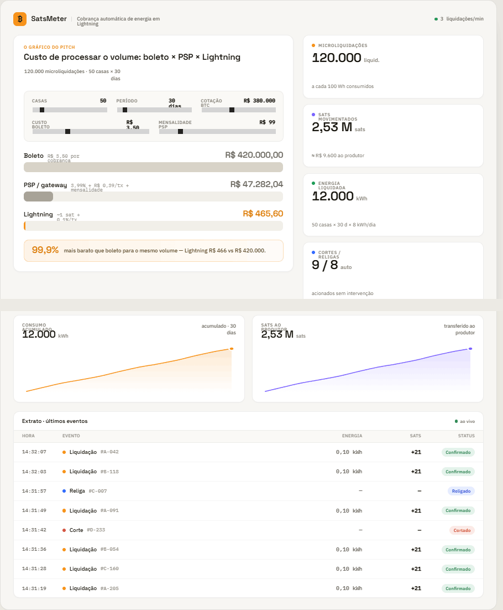

# Handoff: Dashboard Analítico SatsMeter (layout 1b — "Pitch hero")

## Overview
SatsMeter é um medidor de energia comunitário que cobra o consumo automaticamente
em Bitcoin/Lightning por **microliquidações**: a cada `X` Wh consumidos (padrão 100 Wh)
o sistema liquida o valor correspondente em sats direto para o produtor de energia.

Este dashboard é a tela de pitch do projeto. Ele mostra:

- **KPIs totais** — nº de microliquidações, sats movimentados, energia liquidada (kWh),
  cortes/religas automáticos.
- **Séries no tempo** — consumo acumulado (kWh) e sats transferidos ao produtor.
- **O gráfico do pitch** — projeção da cadência real observada para `N casas × M dias`
  e o comparativo do custo de processar esse volume em **boleto × PSP × Lightning**,
  com as premissas (cotação BTC, custo do boleto, mensalidade de PSP, N casas, M dias)
  **ajustáveis ao vivo** por sliders no topo do gráfico.
- **Extrato** — tabela com os últimos eventos (liquidação, corte, religa).

O layout escolhido é o **1b ("Pitch hero")**: uma tela única pensada pro palco, com o
gráfico-estrela em destaque à esquerda, os KPIs em coluna à direita, duas séries no
tempo e um extrato compacto na faixa inferior.



> Referência visual completa do layout 1b em `screenshots/dashboard-1b.png`. Todos os
> valores exatos (cores, tipografia, medidas) estão descritos abaixo — a imagem é só apoio.

## About the Design Files
Os arquivos em `design/` são **referências de design feitas em HTML** (protótipos que
mostram aparência e comportamento pretendidos) — **não são código de produção pra copiar
direto**. Eles estão no formato "Design Component" (`.dc.html`): um template com marcação
+ uma classe de lógica JS. A tarefa é **recriar esse design na stack alvo** (abaixo),
usando os padrões dela — não servir o HTML como está.

- `design/SatsMeter Dashboard.dc.html` — arquivo raiz. Contém **os 3 layouts** (1a, 1b, 1c)
  e, o mais importante, **toda a lógica de cálculo e formatação** na classe `Component`
  (método `renderVals()`). **Recrie só o layout 1b.** As fórmulas dessa classe são a fonte
  de verdade — reproduza-as exatamente (ver seção "Lógica de cálculo").
- `design/SM-Compare.dc.html` — o gráfico do pitch (sliders + barras comparativas + callout).
- `design/SM-Kpi.dc.html` — card de KPI.
- `design/SM-Line.dc.html` — gráfico de série no tempo (SVG área + linha).
- `design/SM-Extrato.dc.html` — tabela do extrato.

## Target stack (definido com o cliente)
- **Backend:** Node.js + **Express** + **TypeScript**.
- **Frontend:** **React** + **TypeScript**.
- **Origem dos dados:** hardware real — **ESP32 + sensor de corrente** (ver seção
  "Integração ESP32"). O backend recebe leituras, acumula energia por casa, dispara as
  microliquidações Lightning e expõe métricas/séries/extrato pro front.

## Fidelity
**Alta fidelidade (hifi).** Cores, tipografia, espaçamentos e interações são finais.
Recrie a UI do 1b fielmente com os valores desta doc. Os componentes React devem
espelhar os quatro blocos de design (`SM-Kpi`, `SM-Line`, `SM-Compare`, `SM-Extrato`).

---

## Screen: Dashboard (layout 1b — "Pitch hero")

### Layout
Container único ("shell"), largura de design **1120px**, cantos arredondados 20px,
borda `1px solid rgba(20,20,20,.10)`, fundo `#f7f6f3`, sombra
`0 20px 50px -30px rgba(20,20,20,.4)`. Padding interno `28px 30px`. Coluna vertical
com `gap: 22px`. No app real, torne responsivo (o design é fixo só pra mockup).

Estrutura de cima pra baixo:

1. **Topbar** (flex, space-between, centralizado):
   - Esquerda: marca `₿` (quadrado 32px, radius 9px, fundo `#f7931a`, glyph `₿` 18px
     Space Grotesk 600 em `#17150f`) + "SatsMeter" (Space Grotesk 600, 17px, `#17150f`)
     + separador vertical + subtítulo "Cobrança automática de energia em Lightning"
     (IBM Plex Sans 500, 12px, `#6b675e`).
   - Direita: indicador ao vivo — bolinha verde `#1f9d57` (7px) + "`{liqPorMin}`
     liquidações/min" (IBM Plex Sans 500, 12px, `#6b675e`).

2. **Bloco hero** — grid 2 colunas `1.55fr 1fr`, `gap: 22px`, itens no topo:
   - **Esquerda:** o gráfico do pitch (`SM-Compare`).
   - **Direita:** coluna (`gap: 14px`) com os **4 KPIs** (`SM-Kpi`) empilhados, na ordem:
     Microliquidações, Sats movimentados, Energia liquidada, Cortes / religas.

3. **Faixa inferior** — grid 3 colunas `1fr 1fr 1.2fr`, `gap: 18px`, itens no topo:
   - `SM-Line` "CONSUMO ACUMULADO" (cor `#f7931a`).
   - `SM-Line` "SATS AO PRODUTOR" (cor `#7b61ff`).
   - `SM-Extrato` (versão curta: **5 primeiras** linhas).

### Component: SM-Kpi (card de KPI)
- Fundo `#fff`, borda `1px solid rgba(20,20,20,.08)`, radius 14px, padding `18px 20px`,
  sombra `0 1px 2px rgba(20,20,20,.03)`, min-height 112px. Flex coluna, `gap: 11px`.
- Linha 1: bolinha 8px (cor = `accent`) + rótulo (IBM Plex Sans 600, 10.5px,
  `letter-spacing:.08em`, uppercase, `#8a857a`).
- Linha 2: valor (Space Grotesk 600, **30px**, `#17150f`, `font-variant-numeric:tabular-nums`,
  `letter-spacing:-.01em`) + unidade (IBM Plex Sans 500, 13px, `#8a857a`).
- Linha 3 (`margin-top:auto`): sub (IBM Plex Sans 400, 12px/1.4, `#6b675e`).
- Os 4 cards e seus `accent`:
  - Microliquidações — accent `#f7931a`, unidade "liquid.", sub `subLiq`.
  - Sats movimentados — accent `#7b61ff`, unidade "sats", sub `subSats`.
  - Energia liquidada — accent `#1f9d57`, unidade "kWh", sub `subEnergia`.
  - Cortes / religas — accent `#2f6bff`, unidade "auto", sub `subCortes`.

### Component: SM-Line (série no tempo)
- Card `#fff`, borda `1px solid rgba(20,20,20,.08)`, radius 14px, padding `18px 20px 14px`,
  sombra `0 1px 2px rgba(20,20,20,.03)`. Flex coluna `gap: 16px`.
- Header (flex space-between): à esquerda, título (IBM Plex Sans 600, 10.5px, uppercase,
  `letter-spacing:.08em`, `#8a857a`) + valor (Space Grotesk 600, 24px, `#17150f`, tabular)
  + unidade (12px, `#8a857a`); à direita, sub (IBM Plex Sans 500, 11.5px/1.3, `#6b675e`,
  alinhado à direita).
- Gráfico SVG `viewBox="0 0 300 110"`, `preserveAspectRatio="none"`, altura 118px, largura 100%:
  - `<polygon>` de área com gradiente vertical (id **único por instância**): stop 0 =
    `color` opacity .20 → stop 1 = `color` opacity 0.
  - `<polyline>` linha: `stroke=color`, `stroke-width:2`, `stroke-linejoin/linecap:round`,
    `vector-effect:non-scaling-stroke`, sem fill.
  - `<circle>` no último ponto: r 3.5, fill `color`, `stroke:#fff`, `stroke-width:2`.
- Instância 1 (consumo): title "CONSUMO ACUMULADO", cor `#f7931a`, unidade "kWh",
  valor `lineKwhValue`, sub `lineKwhSub`.
- Instância 2 (sats): title "SATS AO PRODUTOR", cor `#7b61ff`, unidade "sats",
  valor `lineSatsValue`, sub `lineSatsSub`.

### Component: SM-Compare (o gráfico do pitch) — peça central
- Card `#fff`, borda `1px solid rgba(20,20,20,.08)`, radius 16px, padding `22px 24px 24px`,
  sombra `0 1px 3px rgba(20,20,20,.04)`. Flex coluna `gap: 20px`.
- **Header:** eyebrow "O GRÁFICO DO PITCH" (IBM Plex Sans 600, 10.5px, uppercase,
  `letter-spacing:.08em`, cor `#f7931a`) + título "Custo de processar o volume: boleto ×
  PSP × Lightning" (Space Grotesk 600, 20px/1.15, `#17150f`). À direita: `volumeLabel`
  (IBM Plex Sans 500, 12px/1.4, `#6b675e`, max-width 230px, alinhado à direita).
- **Painel de sliders** (o pedido "sliders no topo, atualiza ao vivo"): flex-wrap,
  `gap:16px 24px`, padding `16px 18px`, fundo `#faf9f6`, borda `1px solid rgba(20,20,20,.06)`,
  radius 12px. Cada slider é um `<label>` (flex coluna, `gap:8px`, min-width 150px, flex:1):
  - Linha de topo (flex space-between): rótulo (IBM Plex Sans 600, 10.5px, uppercase,
    `letter-spacing:.05em`, `#8a857a`) + valor formatado (IBM Plex Mono 600, 12.5px, `#17150f`).
  - `<input type="range">`, `width:100%`, `accent-color:#f7931a`, `cursor:pointer`.
  - **5 sliders**, nesta ordem (key, label, min, max, step):
    1. `casas` — "Casas", 1–500, step 1
    2. `dias` — "Período", 1–365, step 1
    3. `cotacao` — "Cotação BTC", 100000–800000, step 5000
    4. `custoBoleto` — "Custo boleto", 0–12, step 0.1
    5. `pspMensal` — "Mensalidade PSP", 0–600, step 10
  - Ao arrastar qualquer slider, **todos os valores da tela recalculam na hora** (KPIs,
    séries, barras e callout).
- **Barras comparativas** — flex coluna `gap:18px`, uma por rail (Boleto, PSP/gateway,
  Lightning). Cada barra:
  - Linha de topo (flex space-between, baseline): nome (Space Grotesk 600, 15px, `#17150f`)
    + descrição (IBM Plex Mono 400, 11.5px, `#9a958a`); à direita o valor R$ (Space Grotesk
    600, 20px, tabular). Cor do valor: cinza `#6b675e` para Boleto e PSP, laranja `#d97a06`
    para Lightning.
  - Trilho: altura 24px, fundo `#f1efe9`, radius 8px, overflow hidden. Preenchimento:
    `width = pct%` (0–100, proporcional ao maior custo), cor da barra, radius 8px,
    `transition: width .28s cubic-bezier(.4,0,.2,1)`, `min-width:3px`. Cores das barras:
    Boleto `#d8d3c8`, PSP `#a8a297`, **Lightning `#f7931a`** (destacado). O Lightning tem
    `pct` com piso de 0.6% pra continuar visível quando é ínfimo — que é justamente o ponto
    do pitch: boleto/PSP são gigantes, Lightning é um sliver.
  - Descrições: Boleto = "R$ {custoBoleto} por cobrança"; PSP = "{pspPct}% + R$ {pspFixo}/tx
    + mensalidade"; Lightning = "~{lnFee} sat + {lnPct}%/tx".
- **Callout de economia:** faixa com `background: linear-gradient(90deg, rgba(247,147,26,.10),
  rgba(247,147,26,.03))`, borda `1px solid rgba(247,147,26,.28)`, radius 12px, padding
  `14px 18px`, flex align-center `gap:12px`. Número grande `econPct` (Space Grotesk 600,
  22px, `#d97a06`) + texto `econLabel` (IBM Plex Sans 500, 13px/1.4, `#5c4a28`).

### Component: SM-Extrato (tabela de eventos)
- Card `#fff`, borda `1px solid rgba(20,20,20,.08)`, radius 14px, overflow hidden,
  sombra `0 1px 2px rgba(20,20,20,.03)`.
- Header (flex space-between, padding `16px 20px 14px`): "Extrato · últimos eventos"
  (Space Grotesk 600, 13px, `#17150f`) + "ao vivo" com bolinha verde `#1f9d57`.
- Linha de cabeçalho e linhas de dados usam o **mesmo grid**:
  `grid-template-columns: 88px 1fr 96px 132px 120px`, `gap:8px`, padding `12px 20px`.
  Cabeçalho: fundo `#faf9f6`, bordas horizontais `rgba(20,20,20,.06)`, rótulos IBM Plex Sans
  600, 10px, uppercase, `letter-spacing:.06em`, `#9a958a` — colunas: Hora, Evento, Energia
  (à direita), Sats (à direita), Status (à direita).
- Cada linha (`border-bottom: 1px solid rgba(20,20,20,.045)`, align-center):
  - Hora: IBM Plex Mono 500, 12px, `#6b675e`.
  - Evento: bolinha 8px (cor por tipo) + tipo (IBM Plex Sans 500, 13px, `#17150f`) + casa
    (IBM Plex Mono 500, 12px, `#9a958a`).
  - Energia: IBM Plex Mono 500, 13px, `#6b675e`, à direita ("0,10 kWh" ou "—").
  - Sats: IBM Plex Mono 600, 13px, `#17150f`, tabular, à direita ("+21" ou "—").
  - Status: pill (IBM Plex Sans 600, 11px, padding `5px 10px`, radius 20px) com cor/fundo por tipo.
- Cores por tipo de evento:
  - **Liquidação** — bolinha `#f7931a`; status "Confirmado", texto `#1f7a45`, fundo `rgba(31,157,87,.12)`.
  - **Religa** — bolinha `#2f6bff`; status "Religado", texto `#2451c9`, fundo `rgba(47,107,255,.12)`.
  - **Corte** — bolinha `#e0533d`; status "Cortado", texto `#c23b26`, fundo `rgba(224,83,61,.12)`.
- Na versão curta (1b) mostre as **5 primeiras** linhas.

---

## Lógica de cálculo (fonte de verdade — reproduzir exatamente)
Reproduza no backend (Express/TS). Estes são os campos e fórmulas do `renderVals()` do
arquivo raiz de design. **Premissas** (ajustáveis; defaults entre parênteses):

| chave        | significado                    | default |
|--------------|--------------------------------|---------|
| `cotacao`    | R$ por BTC                     | 380000  |
| `casas`      | nº de casas na projeção        | 50      |
| `dias`       | período da projeção (dias)     | 30      |
| `whLiq`      | Wh por microliquidação         | 100     |
| `kwhDia`     | consumo médio por casa (kWh/d) | 8       |
| `precoKwh`   | preço da energia (R$/kWh)      | 0.80    |
| `custoBoleto`| custo por boleto (R$)          | 3.50    |
| `pspMensal`  | mensalidade do PSP (R$/mês)    | 99      |
| `pspFixo`    | taxa fixa PSP por tx (R$)      | 0.39    |
| `pspPct`     | taxa % do PSP por tx           | 3.99    |
| `lnFee`      | fee Lightning por tx (sats)    | 1       |
| `lnPct`      | fee % Lightning por tx         | 0.1     |

Derivados:
```
satsPorBrl  = 1e8 / cotacao                       // 1 BTC = 100.000.000 sats
liquN       = casas * dias * kwhDia * 1000 / whLiq // nº de microliquidações
energia     = casas * dias * kwhDia                // kWh liquidados
valorTotal  = energia * precoKwh                   // R$
satsMov     = valorTotal * satsPorBrl              // sats movimentados
valorPorLiq = valorTotal / liquN                   // R$ por microliquidação
cortes      = max(1, round(casas * dias * 0.006))
religas     = max(0, round(cortes * 0.92))
liqPorMin   = max(1, liquN / (dias * 24 * 60))

// custo de processar o volume na cadência real (uma cobrança POR microliquidação):
custoBoleto = liquN * custoBoleto_unit
custoPsp    = liquN * (pspFixo + valorPorLiq * pspPct/100) + pspMensal * (dias/30)
custoLn     = liquN * (lnFee/satsPorBrl + valorPorLiq * lnPct/100)
maxC        = max(custoBoleto, custoPsp, custoLn, 1)   // p/ normalizar as barras
econ        = (1 - custoLn/custoBoleto) * 100          // % de economia vs boleto

// pct das barras (0–100):
pctBoleto = custoBoleto/maxC*100
pctPsp    = custoPsp/maxC*100
pctLn     = max(custoLn/maxC*100, 0.6)   // piso p/ ficar visível
```
Com os defaults isso dá ~**120.000** microliquidações, ~**2,53 M sats** (~R$ 9.600),
**12.000 kWh**, e no comparativo ~R$ 420.000 (boleto) × ~R$ 47 mil (PSP) × ~R$ 468 (Lightning)
→ economia ~**99,9%**.

### Séries no tempo (uma amostra por dia, acumulada)
```
W=300, H=110, P=6              // viewBox do SVG
dailyBase = casas * kwhDia
para d = 0..dias-1:
  dayK = dailyBase * (1 + 0.18*sin(d*0.6) + 0.06*sin(d*1.7))   // wiggle determinístico
  accK += dayK                         // consumo acumulado (kWh)  -> série "consumo"
  accS += dayK * precoKwh * satsPorBrl // sats acumulados          -> série "sats ao produtor"
// mapear cada valor v[i] pro SVG:
x = P + (i/(n-1)) * (W - 2P)
y = H - P - (v/max) * (H - 2P)         // max = maior valor da série
// polygon de área = "P,(H-P)" + todos os pontos + "(W-P),(H-P)"
// dot = último ponto da linha
```
Com dados reais do ESP32 você substitui esse wiggle sintético pelas leituras reais
acumuladas por dia (ou por hora).

### Formatação (pt-BR)
- Inteiros: `Intl.NumberFormat('pt-BR')` arredondado (ex. "120.000").
- R$: prefixo `"R$ "` + `Intl.NumberFormat('pt-BR', {min/maxFractionDigits})`
  (2 casas em geral; 0 casas em cotação/valores grandes; 4 casas em "1 sat ≈ R$ ...").
- Sats compacto: ≥1e6 → `{n/1e6 com 2 casas} M`; ≥1e3 → `{n/1e3 com 1 casa} k`; senão inteiro.
- Textos dos subs/labels:
  - `subLiq` = "a cada {whLiq} Wh consumidos"
  - `subSats` = "≈ {R$ valorTotal, 0 casas} ao produtor"
  - `subEnergia` = "{casas} casas × {dias} d × {kwhDia} kWh/dia"
  - `subCortes` = "acionados sem intervenção"
  - `volumeLabel` = "{liquN} microliquidações  ·  {casas} casas × {dias} dias"
  - `econLabel` = "mais barato que boleto para o mesmo volume — Lightning {R$ custoLn,0} vs {R$ custoBoleto,0}."
  - `econPct` = "{econ, 1 casa}%"

---

## Interactions & Behavior
- **Sliders ao vivo:** onChange de qualquer range atualiza o estado de premissas e recalcula
  TODA a tela imediatamente (sem submit). No React, um único estado `assumptions` +
  `useMemo` derivando todos os campos. As barras animam a largura (`transition .28s`).
- **Barras comparativas:** o preenchimento é proporcional ao maior custo; Lightning tem piso
  de 0.6% pra nunca sumir. Esse contraste dramático (boleto enorme, Lightning sliver) é
  intencional — é o argumento do pitch.
- **Indicadores "ao vivo":** bolinha verde + `liqPorMin` na topbar e "ao vivo" no extrato.
  Com o ESP32 conectado, alimente com o ritmo real de eventos.
- **Extrato:** ordenado do mais recente pro mais antigo; novos eventos entram no topo.

## State Management (sugestão React)
- `assumptions`: objeto com as 12 premissas acima (só 5 expostas em slider no 1b; as demais
  podem ficar em config).
- `metrics` (derivado, `useMemo(assumptions)`): todos os campos da seção de cálculo.
- `series` (derivado ou vindo do backend): arrays de pontos das duas séries.
- `events`: lista do extrato (do backend / stream do ESP32).
- Fetching: no hackathon, os KPIs de projeção são puro cálculo client-side a partir dos
  sliders. Os dados **reais** (séries observadas + extrato) vêm do backend.

## Integração ESP32 + sensor de corrente
Fluxo pretendido (documentar/implementar no backend Express/TS):

1. **Sensor** (ex. SCT-013 não-invasivo ou ACS712) mede **corrente (A)** por casa. O ESP32
   calcula potência `P = V * I` (V da rede, ex. 127/220) e **integra no tempo** pra obter
   energia em Wh: `Wh += P * Δt/3600`.
2. **ESP32 → backend:** envia leituras periódicas (recomendado **MQTT** ou HTTP POST), ex.:
   `POST /api/readings` com `{ casaId, watts, wh, ts }`. Para muitas casas, MQTT (tópico
   `satsmeter/<casaId>/reading`) escala melhor; um broker (Mosquitto) + cliente `mqtt` no
   Express.
3. **Acumulador por casa:** o backend soma `wh` por casa. Quando o acumulado cruza `whLiq`
   (100 Wh), **dispara uma microliquidação**: calcula sats = `(whLiq/1000) * precoKwh *
   satsPorBrl`, emite pagamento Lightning ao produtor, zera/decrementa o acumulador e
   **grava um evento** de "Liquidação" no extrato.
4. **Cortes/religas:** regra de negócio (ex. saldo/pré-pago esgotado → "Corte"; recarga →
   "Religa"). Gerar eventos correspondentes.
5. **Backend → frontend:** exponha (a) `GET /api/metrics` (totais + séries agregadas),
   (b) `GET /api/events` (extrato) e (c) um canal ao vivo — **WebSocket** (`ws`/`socket.io`)
   ou **SSE** — pra empurrar novos eventos/pontos conforme chegam do ESP32. As séries
   acumuladas do gráfico passam a vir das leituras reais em vez do wiggle sintético.
6. **Lightning:** integrar com LND/Core Lightning/LNbits (ex. keysend/BOLT11) pra as
   liquidações reais; no MVP dá pra mockar a chamada e só registrar o evento.

> Segurança: autentique os dispositivos (token/cert por ESP32), valide `casaId`, e trate
> reconexão/perda de pacote (o acumulado é idempotente por timestamp).

---

## Design Tokens
**Cores**
- Fundo shell `#f7f6f3`; página/canvas `#eceae4`; cards `#fff`; faixa escura `#17150f`.
- Tinta texto `#17150f`; secundário `#6b675e`; terciário/labels `#8a857a` / `#9a958a`.
- Borda cards `rgba(20,20,20,.08)`; borda shell `rgba(20,20,20,.10)`; divisórias `rgba(20,20,20,.045–.06)`.
- Trilho de barra `#f1efe9`; superfície sutil `#faf9f6`.
- **Acentos:** BTC/Lightning laranja `#f7931a` (hover/escuro `#d97a06` / `#b5620a`);
  roxo (sats/Lightning secundário) `#7b61ff`; verde (ok/online) `#1f9d57` (texto `#1f7a45`);
  azul (religa) `#2f6bff` (texto `#2451c9`); vermelho (corte) `#e0533d` (texto `#c23b26`).
- Barras do comparativo: Boleto `#d8d3c8`, PSP `#a8a297`, Lightning `#f7931a`.

**Tipografia** (Google Fonts)
- Títulos/números: **Space Grotesk** (400/500/600/700).
- Corpo/labels: **IBM Plex Sans** (400/500/600).
- Números mono/tabulares: **IBM Plex Mono** (400/500).
- Números grandes usam `font-variant-numeric: tabular-nums` e `letter-spacing:-.01em`.

**Radii:** cards 14px; comparativo/shell 16–20px; pills/trilhos 8–20px; marca 9–10px.
**Sombras:** card `0 1px 2px rgba(20,20,20,.03)`; comparativo `0 1px 3px rgba(20,20,20,.04)`;
shell `0 20px 50px -30px rgba(20,20,20,.4)`.
**Espaçamento:** grids/colunas `gap` 14–22px; padding de card 18–24px.

## Assets
Nenhuma imagem/ícone externo. A marca é o caractere Unicode **`₿`** (U+20BF) num quadrado
laranja — sem SVG. As bolinhas de status e barras são CSS puro. Os gráficos de série são
**SVG inline** (polyline + polygon com gradiente). Fontes via Google Fonts (links no
`<head>`).

## Files
- `screenshots/dashboard-1b.png` — captura de referência do layout 1b (a implementar).
- `design/SatsMeter Dashboard.dc.html` — layouts (recrie **1b**) + **toda a lógica** em `renderVals()`.
- `design/SM-Compare.dc.html` — gráfico do pitch.
- `design/SM-Kpi.dc.html` — card de KPI.
- `design/SM-Line.dc.html` — série no tempo.
- `design/SM-Extrato.dc.html` — extrato.

Abra qualquer `.dc.html` no navegador pra ver o componente renderizado e comparar pixel a pixel.
